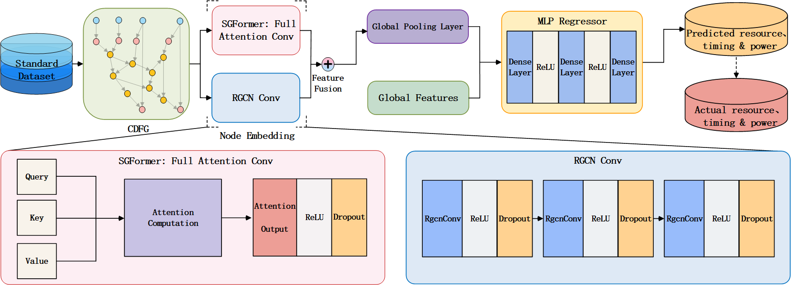

# SGFormer-RGCN: Accurate Performance Prediction for High-Level Synthesis Design Space Exploration

## Content
- [About the project](#about-the-project)
- [Required environment](#required-environment)
- [Dataset](#dataset)
- [Baseline](#baseline)
## About the project
We propose a high-precision performance prediction model, SGFormer-RGCN, that integrates both global and local modeling capabilities. The model organically combines the global contextual representation strength of SGFormer with the local structural awareness of the RGCN. By introducing a learnable adaptive fusion mechanism, the model dynamically allocates weights between global and local features, enabling more flexible and efficient information integration. This mechanism not only captures long-range dependencies but also identifies fine-grained structural patterns. 

### Contribution
- We adopt RGCN as the core predictive module, combined with a global pooling mechanism for feature integration. RGCN effectively leverages multi-relational edge types during message propagation, enhancing the model's ability to capture semantic dependencies among nodes. Compared to hierarchical pooling methods, global pooling does not require the introduction of additional node or edge selection mechanisms, thereby preserving the complete structural information of the graph.
- To overcome the limitation of conventional GNNs in modeling long-range dependencies, we propose a hybrid architecture SGFormer-RGCN. This model incorporates the SGFormer module, which employs a global attention mechanism with linear computational complexity to enable full-node interaction across the graph. By combining the local multi-relation aggregation capabilities of RGCN with the global dependency modeling of SGFormer, SGFormer-RGCN jointly captures both fine-grained local structures and holistic semantic patterns, significantly improving prediction accuracy and generalization capability.
- Experimental results show that SGFormer-RGCN achieves an average prediction error of 2.70\%–7.18\% across key performance metrics, including resource utilization, critical path timing, and power consumption, significantly outperforming existing methods. These results demonstrate the model's superiority and robustness in HLS performance prediction tasks.

## Required environment
### Python Environmant
- python 3.9
- torch 1.13.1
- torch-geometric 2.3.1
- torch-scatter 2.1.1
- torch-sparse 0.6.17
- optuna 3.2.0
- pyDOE 0.3.8
### Vitis Environment
- Vitis HLS 2022.1
- Vivado 2022.1

## Dataset
- The proposed SGFormer-RGCN model is implemented using the PyTorch Geometric framework and evaluated on the standard dataset presented in *HGBO-DSE: Hierarchical GNN and Bayesian Optimization Based HLS Design Space Exploration* ([IEEE ICFPT 2023](https://ieeexplore.ieee.org/abstract/document/10416120)). This dataset is derived from the publicly available benchmark suite MarchSuite, encompassing 10 benchmarks such as aes and bfs, and a total of 11,327 design instances. These instances cover four levels of optimization directives: Function, Loop, Array, and Operator. Each instance is represented by graph structures and features generated from CDFGs and HLS reports.
- Standard dataset is available at https://pan.baidu.com/s/1vuNft44EYGcK7SKpoXHm6w. (Extraction code: cewy)
## Baseline
This project includes the following baseline models for performance comparison:
- IRONMAN-PRO
- GCN+GF
- GAT+GF
- SAGE+GF
- RGCN+GF

Implementation code and pre-trained models are available under the [`baseline/`](./baseline/).
